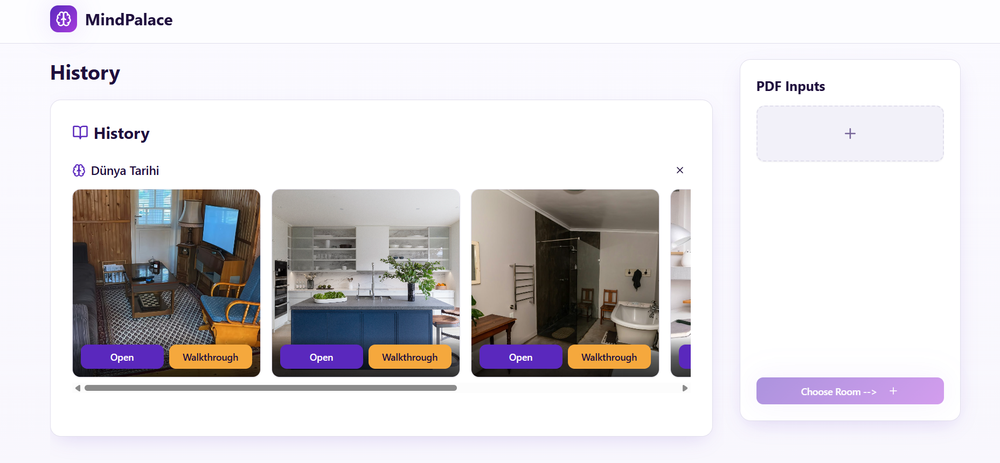
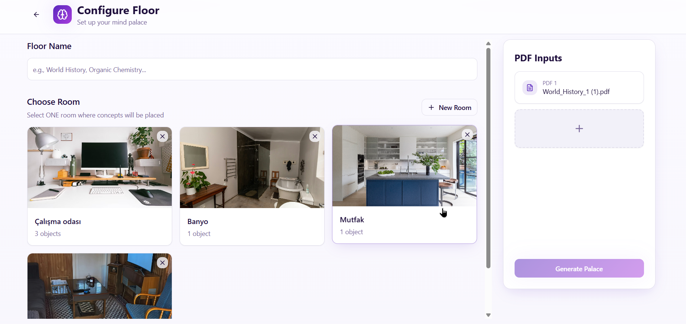
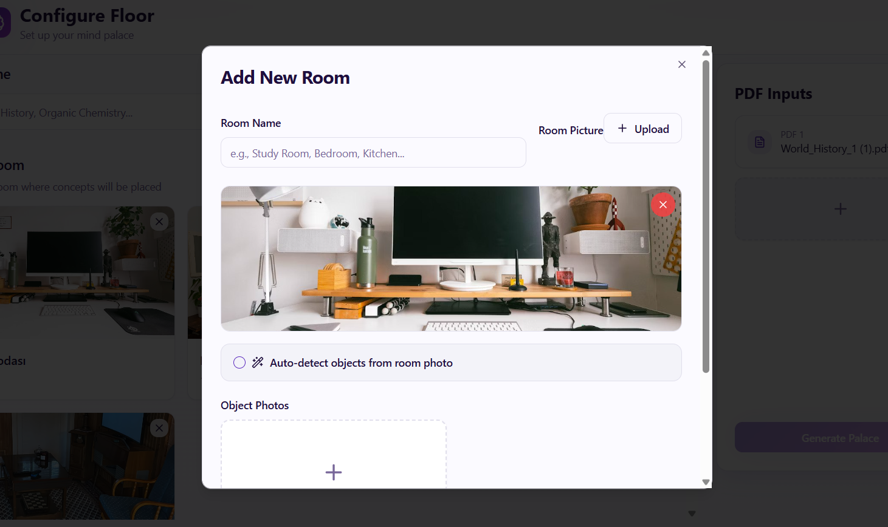
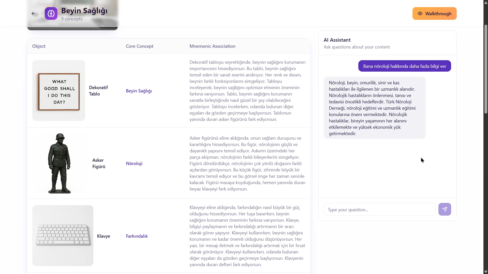

# Mind Palace - AI-Powered Memory Enhancement System

An intelligent web application that transforms learning materials into memorable experiences using the ancient Memory Palace technique, enhanced by modern AI.

## 🎯 The Problem

The Memory Palace technique is proven effective by top memory competitors, but requires significant creativity and mental effort. Most learners struggle to create vivid associations and structured mental spaces on their own.

## 💡 Our Solution

Mind Palace uses AI to automate the creative heavy-lifting, making this powerful memorization technique accessible to everyone. Simply upload your study materials, and our system generates a complete memory palace with vivid, memorable associations.

## 🏗️ How It Works

1. **Upload PDFs** - Add your study materials (textbooks, notes, papers)
2. **Create Rooms** - Upload room objects photos or auto-detect objects from single room image
3. **AI Generation** - System creates associations between room objects and concepts
4. **Study & Review** - Walk through your memory palace with interactive visualizations

## 🖼️ Application Preview
<table>
  <tr>
    <td align="center" width="50%">
      <b>The Main dashboard shows previous works, and you can create a new Memory Palace from PDF document, which will be processed by OCR model.</b><br><br>
      
    </td>
    <td align="center" width="50%">
      <b>The Choose Room page has several rooms you have created before, or some ready room interiors you can use right away.</b><br><br>
      
    </td>
  </tr>
  <tr>
    <td align="center" width="50%">
      <b>In Add New Room section you can either upload photos of objects yourself or let AI create their photos from Room photo. Each object gets labeling and description with Llama 4 17B model.</b><br><br>
      
    </td>
    <td align="center" width="50%">
      <b>The Association table page includes your rooms objects pairing with concepts from PDF in a transitive way. There is also chatbot with RAG integrated, where you can ask for more questions about concepts.</b><br><br>
      
    </td>
  </tr>
</table>

## 🌟 Key Features

### Pages & Interfaces
- **Home Dashboard** - View and manage all your memory palaces (floors)
- **Configure Floor** - Upload PDFs, select rooms, generate associations
- **Table View** - Review all object-concept pairs with mnemonic associations
- **3D Walkthrough** - Interactive first-person exploration of your memory palace
- **AI Chatbot** - Ask questions about your study materials with RAG-powered answers

### AI Technologies Used

| Technology | Model/Tool | Purpose |
|------------|------------|---------|
| **Vision AI** | Llama 4 Vision (Groq API) | Analyze room images, detect objects, generate labels |
| **Language AI** | Llama 4 17B | Create mnemonic associations, concept extraction |
| **Image Generation** | Qwen Image Edit (fal.ai API) | Extract individual objects from room photos |
| **OCR** | PyMuPDF + Groq Vision | Extract text and concepts from PDF documents |
| **RAG System** | ChromaDB + Llama 8B Embedding | Semantic search for chatbot Q&A |

### Core Techniques

- **Prompt Engineering** - Crafted prompts for Turkish output, story-based associations (4-6 sentences), vivid imagery
- **RAG (Retrieval Augmented Generation)** - Context-aware answers using vector similarity search
- **OCR + Vision** - Hybrid approach: PyMuPDF for text extraction, Groq Vision for complex documents
- **Story Chaining** - Sequential associations that flow naturally from one object to the next
- **Multi-modal AI** - Combines text, images, and spatial relationships for enhanced memory

## 🛠️ Tech Stack

**Frontend**: React, TypeScript, Three.js, TailwindCSS  
**Backend**: FastAPI (Python), Supabase (PostgreSQL)  
**AI Infrastructure**: Groq API, fal.ai, ChromaDB, HuggingFace Transformers  

## 🚀 Quick Start

### Prerequisites
- Node.js 18+
- Python 3.9+
- Supabase account
- Groq API key
- fal.ai API key

### Installation

```bash
# Clone repository
git clone https://github.com/yourusername/mind-palace-craft.git
cd mind-palace-craft

# Frontend setup
npm install
npm run dev

# Backend setup
pip install -r requirements.txt
# terminal 1
cd alpaca
python api_server.py
# terminal 2 (from main folder)
npm run dev


